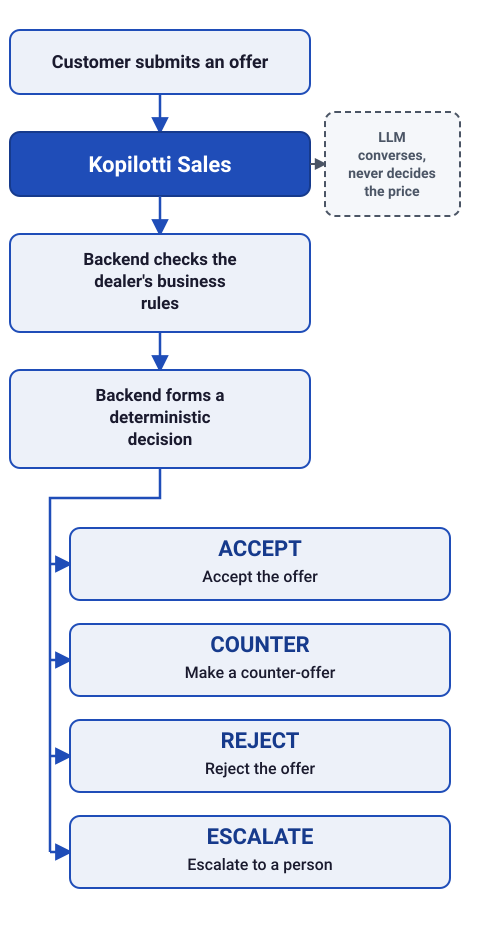

**English** | [Suomi](README.fi.md)

# Kopilotti Sales

Dealer-controlled price-negotiation software for automotive digital retail.

Kopilotti Sales helps used-car dealers, dealer groups, automotive marketplaces and dealer platforms move online buyers from vehicle interest to an agreed transaction — 24/7. AI handles the customer conversation; deterministic rules keep pricing authority with the dealer.

This public repository presents the product concept, demonstrator and external operating principles. It does not contain the private transaction engine, dealer-specific commercial rules, production integrations or other protected implementation details.


## [🚀 Try the price-negotiation demo](https://app.kopilotti.online/vehicle.html)

[Open the Kopilotti Sales site (English)](https://app.kopilotti.online/en/) · [Go straight to the Alfa Romeo Giulia Quadrifoglio demo](https://app.kopilotti.online/vehicle.html)

> **Concept demonstrator – does not require strong identity verification and does not create a binding offer.** The interactive negotiation interface itself is presented in Finnish; see [Current scope](#current-scope).

[](https://app.kopilotti.online/vehicle.html)

## 2. Product overview / Tuote-esittely

- [Suomenkielinen tuote-esittely (PDF)](docs/kopilotti-sales-overview-fi.pdf)
- [English product overview (PDF)](docs/kopilotti-sales-overview-en.pdf)
- [Saavutettava suomenkielinen tekstiversio](docs/kopilotti-sales-overview-fi.md)
- [Accessible English text version](docs/kopilotti-sales-overview-en.md)

## How it works



> **The LLM converses. The backend decides.** The language model never accepts, rejects or prices an offer.

---

## What problem it addresses

Most of a used-vehicle purchase can already be completed digitally: finding a vehicle, comparing options, reviewing a condition report, applying for financing, signing a contract. One step is still routinely manual — price negotiation. In many dealerships a customer's offer still travels through a salesperson, a trade-in manager and a manual decision before the customer gets an answer. Buying intent can fade in that wait, and it very often happens outside business hours: customers browse and are ready to negotiate in the evening, at night, or on the weekend, when no one is available to respond.

## What the demonstrator shows

Kopilotti Sales acts as a digital salesperson that can:

- hold a bounded price negotiation with the customer
- make counter-offers within the dealer's own pricing rules
- accept an offer within the limits the dealer has configured
- escalate exceptional cases to a person
- form a deal at the agreed price
- hand the customer to the dealer's own checkout and payment process

The public demonstrator's scope ends at the agreed-price transaction and handing the customer to the dealer's own process. It is not an auction, a bidding system, or an automated clearance channel — the vehicle is sold at the market price and terms the dealer has set, under ordinary consumer-sales conditions.

## High-level transaction flow

```text
Customer interaction
→ dealer-controlled commercial decision
→ purchase-state progression
→ external regulated service
→ verified completion status
```

The conversational layer (the LLM) talks to the customer, recognizes intent, and produces natural responses. It does not make commercial decisions. A separate deterministic decision layer evaluates every offer against the dealer's own business rules and returns one of four outcomes — accept, counter, reject, or escalate to a person. The decision is never based on the model's opinion, a probability, or free-form text output.

## Dealer control and deterministic safeguards

- The dealer defines every commercial rule: price floors, counter-offer steps, campaigns, and which cases require manual approval — per vehicle, per vehicle group, per price band, or per stock position.
- Price boundaries are evaluated server-side and are never exposed to the browser or delegated to the language model.
- The customer's identity is verified before a price negotiation begins, and the number of automated negotiation rounds per customer and vehicle is limited before the case moves to the dealer.
- Commercial decisions and their basis are recorded traceably.
- Unclear or incomplete situations do not automatically resolve into a price promise — they are escalated.
- Commercial decision logic is isolated from prompt-injection attempts directed at the LLM.

## Financing and regulated-service boundaries

- Kopilotti Sales does not grant credit and does not make lending decisions.
- The platform includes a financing gate, off by default. Where it is enabled, identity verification, the credit application and the credit decision take place in the financing provider's own environment — the platform never receives national ID numbers, income or debt data, or credit-registry data, and never gives the customer a personal financing recommendation.
- A positive financing decision does not by itself release the vehicle for delivery.
- Funds move directly from the customer to the dealer. Kopilotti does not receive, hold, or transfer funds — the dealer confirms payment in its own systems, through the payment service it has chosen.
- Vehicle handover is agreed between the customer and the dealer according to the dealer's normal process.

## Current scope

**Proven in the published demo environment:**

- Vehicle-specific magic-link onboarding: one opaque link per vehicle, behind which the customer finds vehicle data and can start a price negotiation.
- Deterministic price rules configured by the dealer in Kopilotti Admin: accept, counter-offer, reject and escalate to a person.
- After an accepted price, the customer moves, in the current public demo, into the dealer's own transaction process. Financing, payment and vehicle handover are handled in the dealer's own systems.

**Built and tested, not yet in public production traffic:**

- Trade-in and deal-summary handling, as separate traceable steps (vehicle identification, external valuation, a deterministic offer, and settlement).
- A provider-independent integration boundary designed to support a vehicle-valuation provider; going live requires a licensed agreement and credentials, which are not yet in place.
- A contract, invoice and bank-transfer path from an agreed price toward a paid state — currently a no-go for real payment, gated behind an explicit, clearly marked concept-contract step with no payable account details shown.
- Cryptographic after-the-fact verification of commercial decisions, built and tested; not configured on the public path.

The current demonstrator models a Finnish dealer transaction. Market-specific financing, consumer-law, payment and vehicle-registration integrations would need to be implemented separately for each country, and are not part of this public repository or the current live demo.

## What is not included in the public repository

- the production decision engine and its exact acceptance, counter-offer and escalation rules
- price floors, margin calculations, and offer-ladder logic
- internal modules, file layout, or endpoint details of the private backend
- database schema or backend service architecture
- the precise limits of abuse-prevention logic
- financing-provider adapters or non-public financing-partner details
- dealer-specific configuration, integration credentials, or contractual content

## Partnership and integration discussions

Kopilotti Sales is designed for a lightweight pilot: a dealer adds one negotiation link to a vehicle page, without a multi-week integration project. Deeper integrations — DMS, e-commerce, CRM, or a marketplace's own API — are a later, deliberate step once the model has shown its value, and are always subject to a partner agreement.

If you represent an automotive marketplace, a dealer-software platform, or a dealer group and want to discuss a pilot or an integration, get in touch: [hello@kopilotti.online](mailto:hello@kopilotti.online).

## Finnish version

This English README is the primary international overview. The Finnish version, [README.fi.md](README.fi.md), is the detailed original product description, including the full production-status breakdown, architecture notes and roadmap.

## License

Kopilotti Sales is proprietary software. Copying, modifying, distributing, or commercially using the source code without the author's prior written permission is prohibited. See [LICENSE](LICENSE) for full terms.
