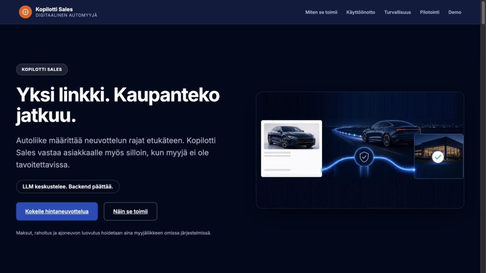

**Suomi** | [English](README.en.md)

# Kopilotti Sales

Kopilotti Sales on kaupallinen ohjelmistotuote ja digitaalinen kaupankäyntikerros käytettyjen ajoneuvojen myyntiin.

Tämä repositorio esittelee tuotteen toimintaa, käyttöliittymää, arkkitehtuuria ja tuotantorajoja.

Julkinen repositorio ei sisällä tuotannon päätösmoottoria, jälleenmyyjäkohtaisia sääntöjä, integraatiotunnuksia eikä kaupallisten rajapintojen sopimussisältöä.


## [🚀 Kokeile hintaneuvotteludemoa](https://app.kopilotti.online/vehicle.html)

[Avaa Kopilotti Sales -sivusto](https://app.kopilotti.online/) · [Siirry suoraan Alfa Romeo Giulia Quadrifoglio -demoon](https://app.kopilotti.online/vehicle.html)

[▶ Katso Kopilotti Salesin esittelyvideo (2:37)](https://app.kopilotti.online/esittelyvideo) · [lataa MP4 (11 Mt)](assets/kopilotti-sales-esittelyvideo-2026-09.mp4)

[📄 Lataa yhden sivun asiakas- ja sijoittajatiivistelmä](docs/kopilotti-sales-asiakas-sijoittajatiivistelma.pdf)

> **Konseptidemo – ei vaadi vahvaa tunnistautumista eikä synnytä sitovaa tarjousta.**

> **Perinteinen verkkokauppa digitalisoi listahintaisen ostamisen.**
>
> **Kopilotti Sales digitalisoi hintaneuvottelun.**

Kopilotti Sales jatkaa käytetyn auton kaupantekoa verkossa silloin, kun asiakas on valmis keskustelemaan hinnasta.

Se lisää nykyiseen digitaaliseen ostopolkuun asiakkaan tarjouksen, rajatun neuvottelun ja deterministisen hinnanpäätöksen. Myyjäliikkeen päätösvalta säilyy, ja kaikki kaupalliset päätökset tehdään palvelimella myyjäliikkeen omien liiketoimintasääntöjen mukaisesti.

Kopilotti Sales ei ole chatbot.

Kopilotti Sales ei ole automaattinen hinnoittelujärjestelmä.

Kopilotti Sales ei korvaa automyyjää.

Se digitalisoi käytettyjen ajoneuvojen kaupan viimeisen merkittävän manuaalisen vaiheen ennen kauppoja.

[](https://app.kopilotti.online/vehicle.html)

## 2. Product overview / Tuote-esittely

- [Suomenkielinen tuote-esittely (PDF)](docs/kopilotti-sales-overview-fi.pdf)
- [English product overview (PDF)](docs/kopilotti-sales-overview-en.pdf)
- [Saavutettava suomenkielinen tekstiversio](docs/kopilotti-sales-overview-fi.md)
- [Accessible English text version](docs/kopilotti-sales-overview-en.md)

## Näin Kopilotti Sales toimii


> **LLM keskustelee. Backend päättää.** Kielimalli ei koskaan hyväksy, hylkää tai hinnoittele tarjousta.

---

<a id="current-scope"></a>

# Tuotannon tila

> **Nykytilapäivitys 26.8.2026:** Julkaistun demon tuotantobackend käyttää nyt pysyvää PostgreSQL-tallennusta neuvottelusessioille. Tenant-rajattu session käyttö ja tenant-suhteiden tietokantatason eheysrajat ovat käytössä. Julkaisu varmennettiin tuoreella backup/restore-testillä sekä skeema- ja readiness-porteilla. Tämä ei ota käyttöön maksukelpoista kauppapolkua, VIS-yhteyttä tai DDN-todennusta.

## Todistettu julkaistussa demoympäristössä

- Magic Link -käyttöönotto: yksi autokohtainen, läpinäkymätön linkki, jonka takaa asiakas löytää auton tiedot ja voi aloittaa hintaneuvottelun
- Autoliikkeen Kopilotti Adminissa määrittämät deterministiset hintasäännöt: hyväksyntä, vastatarjous, hylkäys ja eskalointi ihmiselle
- Neuvottelusessioiden pysyvä palvelinpuolen tallennus tuotantotietokantaan
- Tenant-rajattu session käyttö sovellusrajalla sekä tenant-suhteiden eheys tietokantatasolla
- Tuotannon skeema- ja readiness-varmennus sekä palautuskelpoisuuden todentava backup/restore-testi
- Hyväksytyn hinnan jälkeen asiakas siirtyy nykyisessä julkisessa demossa myyjäliikkeen omaan kaupantekoprosessiin. Rahoitus, maksut ja ajoneuvon luovutus hoidetaan myyjäliikkeen omissa järjestelmissä.
- Kopilotti ei vastaanota, säilytä eikä välitä asiakkaan maksuja.

## Rakennettu ja testattu, mutta ei julkisessa tuotantoliikenteessä

- **Trade-in V1 ja DealSnapshot.** Vaihtoauton tunnistaminen, ulkoisesta arvonmäärityksestä saatavan arvion käsittely, deterministinen tarjous, tarjouksen hyväksyminen, väliraha ja muuttumaton kauppayhteenveto on toteutettu erillisinä ja jäljitettävinä vaiheina. Hyväksytty vaihtoautotarjous voidaan käyttää kauppaan vain kerran.
- **VIS / Autovista -integraatioraja.** Providerista riippumaton domain-raja ja adapterirunko ajoneuvon tunnistamiselle ja vaihtoauton arvonmääritykselle ovat erillisessä toteutuksessa. Trade-in-polku on testattu testiproviderilla; varsinaista VIS-yhteyttä ei ole toteutettu tai testattu palvelua vasten. Puuttuva tai epäonnistunut arvonmääritys ohjataan manuaaliseen tarkistukseen.
- **Valinnainen ajoneuvohistorian riskikerros.** Tavoitepolussa myyjäliike voi pyytää VIS-arvonmäärityksen jälkeen ajoneuvohistorian tarkistuksen hinnoittelun ja päätöksenteon tueksi. VIN-tunnistus, palveluntarjoajasta riippumaton historiatieto, jälleenmyyjäkohtainen deterministinen riskipolitiikka, välimuisti/idempotenssi, päiväkohtainen kustannusraja ja tietosuojattu auditointi on toteutettu ja testattu erillisellä kehityshaaralla. Valinnaista vaihetta ei ole vielä kytketty tavoitejärjestyksessä runtimeen tai julkiseen demoon.
- **Alustava carVertical-adapteri.** HTTP-adapteri on yksikkötestattu vain tämän koodipohjan itse olettamaa endpointia, autentikointia ja vastausrakennetta vasten. Oletukset eivät perustu carVerticalin vahvistamaan API-sopimukseen, eikä koodia ole ajettu carVerticalin sandboxia tai oikeaa palvelua vasten. Historiapalvelu tuottaa tukitietoa myyjäliikkeen sääntöihin tai manuaaliseen arvioon; se ei itsessään aseta hyvityshintaa tai tee kaupallista päätöstä.
- **Sopimus-, lasku- ja tilisiirtopolku.** Palvelimen hyväksymästä hinnasta voidaan muodostaa idempotentti kauppapaketti, jonka tilakone on `PRICE_AGREED → CONTRACT_READY → AWAITING_PAYMENT → PAID`.
- **Myyjäliikkeen maksuhallinta.** Kopilotti Adminiin on rakennettu maksuprofiilit, maksua odottavien kauppojen näkymä ja atominen manuaalinen maksuvahvistus. Asiakas ei voi vahvistaa maksua eikä asettaa `PAID`-tilaa. Maksuvahvistuksen kanoninen audit-tapahtuma on samassa tietokantatransaktiossa kirjoitettava `PAID_CONFIRMED`.
- **Maksukelvoton konseptisopimus.** Tuotantoympäristössä konseptiasiakirja vaatii kaksi erillistä, eksplisiittistä käyttöönottoa. Asiakirja merkitään näkyvästi `KONSEPTIDEMO`-tekstillä, eikä siinä näytetä IBANia, BICiä, viitenumeroa, eräpäivää tai maksukehotetta. Polku pysähtyy `CONTRACT_READY`-tilaan.
- **DDN (Deterministic Decision Network) -todennus.** Kaupallisten päätösten kryptografiseen jälkikäteistodennukseen on toteutettu ja testattu erillinen todennusjärjestelmä. Julkisessa tuotantoliikenteessä tila on tällä hetkellä `NOT_CONFIGURED`: siitä ei muodosteta väitettä varmennetusta päätöksestä, päätöskuittia eikä kuittilinkkiä.

> **Integraatioiden tuotantoraja:** aktiivista VIS / Autovista- tai carVertical-yhteyttä ei ole, eikä kumpaankaan liity julkistettua kumppanuutta. Tuotantokytkentä vaatii palveluntarjoajan vahvistaman rajapintasopimuksen, dokumentaation, tunnukset, turvallisen salaisuuksien hallinnan sekä sandbox- ja tuotantoympäristöjen sopimustestauksen.

## Vaaditaan ennen maksukelpoista tuotantopolkua

- Myyjäliikkeen hyväksytty ja hallitsema maksutili sekä palvelinlähtöinen, asiakkaan selaimesta muuttumaton maksutieto
- Maksuohjeen vahva sitominen oikeaan myyjäliikkeeseen, kauppaan, sovittuun hintaan, laskunumeroon ja viitteeseen sekä riippumaton varmennus ennen kuin asiakkaalle näytetään maksukelpoinen IBAN
- Oikea DMS-sopimusintegraatio konseptiasiakirjan tilalle
- Tuotantokatselmus, jossa todennetaan tenant-eristys, atomisuus ja idempotenssi sekä varmistetaan, ettei tietoja vuoda eikä asiakas voi vahvistaa maksua

Täysi lasku–`PAID`-tuotantopolku on näihin asti **NO-GO**. Kun se aikanaan otetaan käyttöön, rahat siirtyvät suoraan asiakkaalta myyjäliikkeelle; Kopilotti ei vastaanota, säilytä eikä välitä rahaa.

## Suunniteltu jatkokehitys, ei nykyinen ominaisuus

- **1–3 erikseen määriteltävää vastatarjoushintaa.** Järjestelmässä on jo kolme automaattista neuvottelukierrosta; tuleva ominaisuus koskee nimenomaan sitä, että autoliike voisi määritellä jokaiselle kierrokselle oman vastatarjoushinnan yhden laskentakaavan sijaan.

---

# Keskeinen ajatus

> **LLM voi keskustella asiakkaan kanssa.**
>
> **LLM voi analysoida ja ehdottaa.**
>
> **LLM ei koskaan päätä hintaa.**

Kaikki kaupalliset päätökset tehdään deterministisesti myyjäliikkeen liiketoimintasääntöjen perusteella.

Tämä erottaa Kopilotti Salesin tavallisista AI-chatboteista ja automatisoiduista hinnoittelujärjestelmistä.

---

# Mikä ongelma ratkaistaan?

Käytettyjen ajoneuvojen verkkokaupassa lähes koko ostoprosessi voidaan jo hoitaa digitaalisesti.

Asiakas voi:

- löytää ajoneuvon verkosta
- vertailla vaihtoehtoja
- hakea rahoituksen
- tutustua myynti-ilmoitukseen ja kuntoraporttiin
- tehdä kaupat
- siirtyä myyjäliikkeen omaan maksuprosessiin

Yksi vaihe on kuitenkin usein edelleen manuaalinen.

Hintaneuvottelu.

Monessa autoliikkeessä asiakkaan tarjous johtaa edelleen samaan ketjuun:

```text
Asiakas
   │
   ▼
Myyjä
   │
   ▼
Vaihtoautopäällikkö
   │
   ▼
Päätös
   │
   ▼
Asiakas odottaa vastausta
```

Juuri tässä vaiheessa ostohalukkuus voi kadota.

Kopilotti Sales poistaa odotuksen silloin, kun päätös voidaan tehdä turvallisesti myyjäliikkeen liiketoimintasääntöjen mukaisesti.

Kun tapaus vaatii ihmisen harkintaa, se siirtyy myyjäliikkeen käsiteltäväksi.

---

# Hintaneuvottelu on osa ostokäyttäytymistä

Käytetyn ajoneuvon ostaminen kuuluu useimmille kotitalouksille suurimpiin yksittäisiin hankintoihin oman kodin jälkeen.

Tässä tuoteryhmässä hinnasta neuvotteleminen on vuosikymmeniä ollut luonnollinen osa ostokäyttäytymistä.

Monelle asiakkaalle listahinta ei ole keskustelun päätös.

Se on keskustelun lähtökohta.

Perinteinen verkkokauppa perustuu kiinteään listahintaan.

Kopilotti Sales ei pyri muuttamaan asiakkaiden ostokäyttäytymistä.

Se digitalisoi sen.

Asiakas voi hyväksyä listahinnan tai aloittaa hintaneuvottelun saman digitaalisen kaupankäyntiprosessin aikana.

---

# Mitä Kopilotti Sales tekee?

Kopilotti Sales toimii digitaalisena automyyjänä, joka voi:

- käydä hintaneuvottelun asiakkaan kanssa
- tehdä vastatarjouksia myyjäliikkeen hinnoittelusääntöjen mukaisesti
- hyväksyä tarjouksen liiketoimintasääntöjen sallimissa rajoissa
- eskaloida poikkeustapaukset ihmiselle
- muodostaa kauppa sovitulla hinnalla
- siirtää asiakas myyjäliikkeen omaan kaupanteko- ja maksuprosessiin

Nykyisessä julkisessa tuotantodemossa Kopilotti Salesin tehtävä päättyy sovitulla hinnalla muodostettuun kauppaan ja asiakkaan siirtämiseen myyjäliikkeen omaan prosessiin.

Kehitys- ja testiympäristöissä rakennettu sopimus-, lasku- ja maksunseurantapolku on kuvattu kohdassa [Tuotannon tila](#tuotannon-tila). Se ei ole vielä julkisen tuotantodemon maksukelpoinen ominaisuus.

Maksut eivät koskaan kulje Kopilotti Salesin kautta. Myyjäliike hoitaa koko kaupanteko- ja maksuprosessin omissa järjestelmissään, valitsemansa maksupalvelun kautta, ja sopii asiakkaan kanssa ajoneuvon luovutuksesta normaalin toimintatapansa mukaisesti.

---

# Mitä Kopilotti Sales ei tee?

Kopilotti Sales:

- ei valitse asiakkaalle ajoneuvoa
- ei arvioi ajoneuvon kuntoa
- ei keskustele kuntoraportin sisällöstä
- ei tulkitse huoltohistoriaa
- ei määritä hinnoittelustrategiaa
- ei hallitse ajoneuvoja
- ei korvaa automyyjää
- ei sovi ajoneuvon luovutuksesta
- ei vastaanota, säilytä tai välitä asiakkaan maksuja
- ei tee kaupallisia päätöksiä LLM:n perusteella

Kopilotti Sales ei ole huutokauppa, tarjouskilpailu tai automaattinen poistomyyntikanava.

Se on käytettyjen ajoneuvojen normaaliin vähittäismyyntiin tarkoitettu digitaalinen hintaneuvottelukanava. Ajoneuvo myydään myyjäliikkeen määrittämällä markkinahinnalla ja liiketoimintasäännöillä.

Kauppa on normaalia autoliikkeen kuluttajakauppaa, johon sovelletaan kuluttajansuojalain mukaisia oikeuksia kaupankäyntikanavasta riippumatta.

Sen tehtävä on yksi:

viedä asiakas turvallisesti hintaneuvottelusta myyjäliikkeen kaupantekoprosessiin.

---

# Missä vaiheessa Kopilotti Sales tulee mukaan?

Kopilotti Sales ei ole asiakkaan ensimmäinen kosketuspiste.

Ennen hintaneuvottelun aloittamista asiakkaalla tulee olla käytettävissään kaikki ostopäätöksen kannalta olennaiset tiedot.

Näihin kuuluvat:

- myynti-ilmoitus
- myyjäliikkeen laatima kuntoraportti

Kun asiakas on tutustunut ajoneuvoon ja päättänyt edetä kohti kauppoja, Kopilotti Sales ottaa vastuun ostoprosessin viimeisestä vaiheesta.

Kopilotti Sales on rakennettu yhtä tarkoitusta varten:

turvalliseen digitaaliseen hintaneuvotteluun ennen kauppoja.

---

# Miksi kuntoraportti on pakollinen?

Kopilotti Sales keskustelee vain hinnasta.

Ajoneuvon kunto, varusteet, huoltohistoria ja muut ostopäätökseen vaikuttavat tiedot kuuluvat myynti-ilmoitukseen ja myyjäliikkeen laatimaan kuntoraporttiin.

Ajoneuvo voidaan julkaista Kopilotti Sales -myyntikanavaan vain, jos kuntoraportti on asiakkaan saatavilla ennen hintaneuvottelun aloittamista.

Kopilotti Sales ei arvioi ajoneuvon kuntoa eikä ota kantaa kuntoraportin sisältöön.

Se edellyttää, että myyjäliike on dokumentoinut ajoneuvon kunnon luotettavasti ennen digitaalisen hintaneuvottelun aloittamista.

Tämä suojaa sekä asiakasta että myyjäliikettä.

---

# Yksi digitaalinen kaupankäyntiprosessi

Asiakas voi:

- hyväksyä listahinnan ja tehdä kaupat
- aloittaa hintaneuvottelun myyjäliikkeen liiketoimintasääntöjen mukaisesti

Molemmat vaihtoehdot käyttävät samaa kaupankäyntimoottoria.

Näin ostokokemus pysyy yhtenäisenä riippumatta siitä, hyväksyykö asiakas listahinnan vai haluaako hän neuvotella hinnasta.

Kun päätös voidaan tehdä automaattisesti, asiakas saa vastauksen välittömästi.

Kun tapaus vaatii ihmisen harkintaa, se siirtyy myyjäliikkeen käsiteltäväksi.

Myyjäliikkeen päätösvalta säilyy kaikissa tilanteissa.

---

# Kevyt käyttöönotto: Magic Link → Admin → API

Ensimmäinen pilotti ei vaadi viikkojen integraatioprojektia. Autoliike lisää jokaisen mukaan otettavan auton sivulle yhden painikkeen:

> **Neuvottele hinnasta**

## Vaihe 1: autokohtainen Magic Link

Painike avaa autokohtaisen esimerkkiosoitteen:

```text
https://sales.kopilotti.online/n/8F3KD91X
```

Linkissä on vain satunnainen, läpinäkymätön tunniste. Se ei sisällä auton hintarajoja tai muita sisäisiä liiketoimintasääntöjä. Kopilotti Sales hakee auton tiedot ja voimassa olevan neuvottelupolitiikan palvelimelta Kopilotti Adminin kautta.

## Vaihe 2: Kopilotti Admin

Myyjä valitsee auton ja määrittää esimerkiksi:

- listahinnan
- alimman hyväksyttävän hinnan
- tarjousportaat
- kampanjat
- voimassaoloajan

Admin luo autokohtaisen linkin ja tarvittaessa valmiin HTML-pätkän:

```html
<a href="https://sales.kopilotti.online/n/8F3KD91X">
  Neuvottele hinnasta
</a>
```

Pilotissa autoliikkeen tekninen työ voi siten rajoittua yhden linkin lisäämiseen auton sivulle.

## Vaihe 3: API ja integraatiot

Kun toimintamalli on osoittanut arvonsa, linkkien luonti ja ajoneuvotietojen päivitys voidaan automatisoida esimerkiksi:

- DMS-järjestelmään
- autoliikkeen verkkokauppaan
- CRM-järjestelmään
- Nettiautoon ja muihin markkinapaikkoihin niiden tarjoamien rajapintojen ja kumppanuuksien kautta

Integraatiot ovat hallittu seuraava vaihe, eivät pilotin aloittamisen edellytys.

> **Raha siirtyy suoraan asiakkaalta myyjäliikkeelle.** Kopilotti ei vastaanota, säilytä eikä välitä varoja. Maksun vahvistaa myyjäliike.

---

# Arkkitehtuuri

```text
                     Asiakas
                        │
                        ▼
                Kopilotti Sales
                        │
                        ▼
              Negotiation Engine
                        │
          ┌─────────────┴─────────────┐
          ▼                           ▼
  Deterministiset                LLM-analyysi
 liiketoimintasäännöt           ja keskustelu
          │                           │
          └─────────────┬─────────────┘
                        ▼
        ACCEPT · COUNTER · REJECT · ESCALATE
                        │
                        ▼
       Myyjäliikkeen kauppa- ja maksuprosessi
```

LLM voi osallistua keskusteluun, tunnistaa asiakkaan tarkoituksen ja muodostaa luonnollisen vastauksen.

Deterministinen päätöksentekokerros tekee kaikki kaupalliset päätökset.

Päätöksenteko ei perustu mallin mielipiteeseen, todennäköisyyteen tai vapaamuotoiseen tekstivastaukseen.

## Rahoitus (portti, ei ominaisuus)

Alusta sisältää rahoitusportin, joka on oletuksena pois käytöstä.
Jos portti otetaan käyttöön, luottohakemus, tunnistautuminen ja
luottopäätös tapahtuvat rahoitusyhtiön omassa ympäristössä.

- Alusta ei vastaanota henkilötunnusta, tulo- tai velkatietoja
  eikä luottotietorekisterin tietoja.
- Alusta ei arvioi luottokelpoisuutta eikä anna asiakkaalle
  henkilökohtaista rahoitussuositusta.
- Myönteinen luottopäätös ei yksinään vapauta ajoneuvoa
  luovutettavaksi.

---

# Julkisen repositorion rooli ja rakenne

Tämä julkinen repositorio toimii **tuote-esittelynä ja selainkäyttöliittymän konseptidemona**. Se näyttää asiakaspolun ja palvelurajapintoja käyttävän frontendin, mutta ei julkaise tuotannon päätösmoottoria, Kopilotti Adminia, jälleenmyyjäkohtaisia liiketoimintasääntöjä, tietokantoja, tunnuksia tai kaupallisten integraatioiden sopimussisältöä.

| Polku | Sisältö |
| --- | --- |
| `index.html` | Tuotesivu, pilotointimalli ja pääsy live-demoon |
| `vehicle.html` | Alfa Romeo Giulia Quadrifoglio -ajoneuvo- ja neuvotteludemo |
| `js/` | Frontendin demo-, neuvottelu- ja ostopolun asiakaslogiikka |
| `styles/` ja `styles.css` | Käyttöliittymän tyylit |
| `inventory.json` | Demon esimerkkiajoneuvot |
| `assets/` | Kuvakaappaukset, kuvat ja muut visuaaliset resurssit |

Tuotannon kaupalliset päätökset tehdään suojatussa taustajärjestelmässä palvelinpuolen sääntöjen mukaisesti.

---

# Arkkitehtuuriperiaatteet

Kopilotti Sales perustuu yksinkertaiseen periaatteeseen:

LLM keskustelee. Backend päättää.

Kaikki kaupalliset päätökset tehdään deterministisesti myyjäliikkeen liiketoimintasääntöjen mukaisesti.

Tämän vuoksi järjestelmä on:

- auditoitava
- ennustettava
- testattava
- selitettävä
- riippumaton yksittäisen kielimallin päätöksenteosta

Kaupalliset päätökset on eristetty LLM:ään kohdistuvista prompt injection -yrityksistä.

---

# Tietoturva ja arkkitehtuuri

LLM käy keskustelun asiakkaan kanssa.

LLM ei päätä hintaa.

Hintapäätöksiä ei koskaan tehdä kielimallin perusteella.

Kaikki kaupalliset päätökset tehdään deterministisessä backendissä, joka tarkistaa aina myyjäliikkeen omat säännöt ennen hyväksyntää.

Tämä arkkitehtuuri on tietoinen suunnitteluratkaisu.

Tarkkaa päätöslogiikkaa ei julkaista tässä repositoriossa.

Asiakkaan identiteetti vahvistetaan sähköpostitse ennen hintaneuvottelun aloittamista, ja järjestelmä rajoittaa saman asiakkaan automaattisten tarjousten määrää yhtä ajoneuvoa kohden ennen siirtoa myyjäliikkeen käsiteltäväksi. Tämä suojaa sekä asiakasta että myyjäliikettä väärinkäytöltä.

---

# Olemassa olevat myyntikanavat, uusi toimintamalli

Useimmilla autoliikkeillä asiakkaat ottavat jo yhteyttä esimerkiksi:

- verkkopalvelun kautta
- chatissa
- WhatsAppilla
- sähköpostitse
- puhelimitse

Kopilotti Sales ei korvaa näitä kanavia eikä rakenna autoliikkeelle uutta verkkokauppaa.

Se digitalisoi hintaneuvottelun osaksi nykyistä myyntiprosessia.

Kun päätös voidaan tehdä liiketoimintasääntöjen perusteella, asiakas saa vastauksen sekunneissa.

Kun tilanne vaatii ihmisen harkintaa, asia siirtyy myyjäliikkeen käsiteltäväksi.

---

# Mitä autoliike ostaa?

Autoliike hankkii digitaalisen myyntikanavan käytettyjen ajoneuvojen hintaneuvotteluun — ei uutta verkkokauppaa, chatbottia tai automaattista hinnoittelijaa.

Tavoitteena on kasvattaa kauppojen määrää vaarantamatta myyjäliikkeen katetta tai päätösvaltaa.

---

# Kopilotti Platform

Kopilotti Sales — tämän repositorion tuote — on osa laajempaa Kopilotti-tuoteperhettä.

Jokaisella tuotteella on oma selkeä vastuunsa, ja yhdessä ne muodostavat saman myyntiprosessin toisiaan täydentävät osat.

```text
Kopilotti Platform

├── Kopilotti
│   AI Sales Copilot myyjälle
│
├── Kopilotti Sales
│   Digitaalinen automyyjä asiakkaalle
│
├── Kopilotti Admin
│   Ajoneuvot, DMS-integraatiot ja liiketoimintasäännöt
│
└── Kopilotti Insights
    Myynti-, neuvottelu- ja käyttäytymisanalytiikka
```

- **Kopilotti** tukee ihmismyyjää asiakaskeskustelun aikana. Se tunnistaa ostosignaaleja, ehdottaa seuraavia toimenpiteitä, tuottaa CRM-yhteenvedon ja suosittelee asiakkaalle sopivia autoja.
- **Kopilotti Sales** palvelee asiakasta suoraan ja vie digitaalista autokauppaa eteenpäin 24/7 determinististen liiketoimintasääntöjen rajoissa.
- **Kopilotti Admin** hallitsee ajoneuvodataa, DMS-tuonteja, jälleenmyyjäkohtaisia asetuksia ja neuvottelupolitiikkoja.
- **Kopilotti Insights** kokoaa järjestelmän tuottaman myynti-, neuvottelu- ja käyttäytymisdatan raportointia varten.

Kopilotti ja Kopilotti Sales eivät ole kilpailevia tuotteita, vaan saman myyntiprosessin toisiaan täydentäviä osia: Kopilotti auttaa ihmismyyjää, ja Kopilotti Sales palvelee asiakasta itsenäisesti silloin, kun myyjää ei ole saatavilla tai asiakas haluaa edetä digitaalisesti.

Yhdessä tuotteet muodostavat AI-avusteisen kaupankäyntialustan, joka kattaa käytettyjen ajoneuvojen myyntiprosessin ensimmäisestä asiakaskontaktista toteutuneeseen kauppaan, hallintaan ja analytiikkaan.

## Kopilotti

Kopilotti on AI Sales Copilot ihmismyyjälle — se tukee myyjää asiakaskeskustelun aikana, ei korvaa häntä eikä tee kaupallisia päätöksiä.

Sen tehtäviin kuuluvat:

- ostosignaalien tunnistaminen asiakaskeskustelusta
- seuraavien toimenpiteiden ehdottaminen myyjälle
- CRM-yhteenvedon tuottaminen
- sopivien ajoneuvojen suositteleminen asiakkaalle

Kopilotti palvelee myyjää; Kopilotti Sales palvelee asiakasta suoraan silloin, kun myyjää ei ole saatavilla tai asiakas haluaa edetä digitaalisesti.

## Kopilotti Sales

Kopilotti Sales on asiakkaalle näkyvä digitaalinen myyntikanava.

Sen vastuulla ovat:

- digitaalinen hintaneuvottelu
- liiketoimintasääntöjen mukainen päätöksenteko
- kaupan muodostaminen
- asiakkaan siirtäminen myyjäliikkeen kaupanteko- ja maksuprosessiin

Sales ei hallitse ajoneuvoja, määritä hinnoittelua, sisällä liiketoimintasääntöjen ylläpitoa eikä käsittele asiakkaan maksuja.

## Kopilotti Admin

Kopilotti Admin on myyjäliikkeen hallintajärjestelmä.

Sen avulla hallitaan:

- ajoneuvot
- DMS-tuonnit
- julkaistavat ajoneuvot
- kuntoraportit
- liiketoimintasäännöt
- käyttäjät
- toimipisteet

Kehitys- ja testiympäristöissä Adminiin on lisäksi rakennettu myyjäliikkeen maksuprofiilien hallinta, maksua odottavien kauppojen näkymä ja atominen manuaalinen maksuvahvistus. Nämä eivät ole vielä osa julkista tuotantoliikennettä.

Kaikki Salesin tekemät kaupalliset päätökset perustuvat Adminissa ylläpidettyihin liiketoimintasääntöihin.

Sales ei sisällä kovakoodattuja hintarajoja tai jälleenmyyjäkohtaisia päätöksiä.

## Kopilotti Insights

Kopilotti Insights tuo näkyväksi digitaalisen myyntikanavan suorituskyvyn.

Esimerkkejä analytiikasta:

- hintaneuvottelujen määrä
- hyväksyttyjen tarjousten määrä
- vastatarjousten määrä
- eskaloitujen tapausten määrä
- toteutuneet kaupat
- konversio
- vastausajat
- ostokäyttäytymisen analytiikka
- myyntikanavien vertailu

Insights auttaa kehittämään myyntiprosessia tiedolla eikä oletuksilla.

---

# Tuotefilosofia

Kopilotti Sales rakentuu neljän periaatteen ympärille.

## Myyjäliike päättää

Kaikki kaupalliset päätökset perustuvat myyjäliikkeen määrittämiin liiketoimintasääntöihin.

## Asiakas tietää, mitä on ostamassa

Hintaneuvottelu alkaa vasta sen jälkeen, kun asiakkaalla on käytettävissään myynti-ilmoitus ja kuntoraportti.

## Digitaalinen kaupankäynti ei saa pysähtyä kellonaikaan

Asiakkaan ei tarvitse odottaa seuraavaan työpäivään saadakseen vastauksen silloin, kun päätös voidaan tehdä turvallisesti automaattisesti.

## Ihminen ratkaisee poikkeukset

Kun tilanne vaatii harkintaa, päätös siirtyy myyjäliikkeelle.

Kopilotti Sales ei korvaa ihmistä.

Se vapauttaa ihmiset niihin tilanteisiin, joissa heidän asiantuntemuksensa tuottaa eniten arvoa.

---

# Kenelle Kopilotti Sales on tarkoitettu?

Kopilotti Sales on suunniteltu erityisesti autoliikkeille, jotka:

- myyvät käytettyjä ajoneuvoja
- käyttävät digitaalista myyntiä
- vastaanottavat hintatarjouksia digitaalisissa kanavissa
- haluavat kasvattaa kauppojen määrää
- haluavat nopeuttaa asiakkaan päätöksentekoa
- haluavat säilyttää päätösvallan kaupallisissa ratkaisuissa

---

# Roadmap

## Kopilotti Sales

Rakennettu ja testattu, ei julkisessa tuotantoliikenteessä:

- hyväksytystä palvelinlähtöisestä hinnasta muodostuva sopimus- ja laskupaketti
- asiakkaan sopimuksen hyväksyntä sekä myyjäliikkeen vahvistaman maksutilan seuranta
- tilakone `PRICE_AGREED → CONTRACT_READY → AWAITING_PAYMENT → PAID`
- maksukelvoton, näkyvästi merkitty konseptisopimus tuotantodemon turvallisuusrajana

Suunnitteilla:

- DDN-todennuksen kytkeminen julkisen neuvottelupolun tuotantoliikenteeseen
- autoliikkeen Adminissa erikseen määriteltävät 1–3 vastatarjoushintaa, nykyisen yhden laskentakaavan sijaan
- API-pohjaiset DMS-, CRM- ja markkinapaikkaintegraatiot Magic Linkin luonnin ja ajoneuvotietojen automatisoimiseksi
- VIS / Autovista -tuotantokytkentä lisensoidun rajapintasopimuksen ja tunnusten perusteella
- ajoneuvohistorian tuotantokytkentä palveluntarjoajan vahvistaman API-sopimuksen, sandboxin ja kaupallisen sopimuksen perusteella

Nämä ovat suunniteltuja integraatioita ja ominaisuuksia, eivät nykyisiä.

## Kopilotti Admin

Rakennettu ja testattu, ei julkisessa tuotantoliikenteessä:

- tiedosto- ja adapteripohjaiset DMS-tuonnit (esikatselu ja vahvistus ennen tuotantoon vientiä)
- ajoneuvojen ja toimipisteiden näkyvyyden hallinta digitaalisessa myyntikanavassa
- hintaneuvottelujen lukkojen hallinta
- myyjäliikkeen maksuprofiilin hallinta
- vain oman myyjäliikkeen maksua odottavat kaupat näyttävä näkymä
- atominen manuaalinen maksuvahvistus ja kanoninen `PAID_CONFIRMED`-audit trail

Suunnitteilla:

- kuntoraporttien hallinta
- liiketoimintasääntöjen laajempi hallinta
- käyttäjähallinta
- muodolliset julkaisu- ja hyväksyntäprosessit

## Kopilotti Insights

Suunnitteilla:

- ostokäyttäytymisen analytiikka
- digitaalisen hintaneuvottelun analytiikka
- kauppojen analytiikka
- konversioraportit
- vastausaikojen seuranta
- liiketoimintaraportointi

## Vaihtoauto ja väliraha

**Status: rakennettu ja testattu, mutta ei vielä osa julkisen demon tuotantoliikennettä.**

Trade-in V1:n tavoitepolku käsittelee vaihtoauton tunnistamisen, ulkoisesta arvonmäärityksestä saatavan arvion, myyjäliikkeen valitseman ajoneuvohistorian tarkistuksen, deterministisen tarjouksen, tarjouksen hyväksymisen, välirahan ja kauppayhteenvedon erillisinä, jäljitettävinä vaiheina.

Ostettavan auton hinnat johdetaan palvelinpuolen ostosessiosta ja ajoneuvotiedoista. Hyväksytty vaihtoautotarjous voidaan käyttää kauppaan vain kerran, ja puuttuva tai epäonnistuva tunnistus tai arvonmääritys ohjataan manuaaliseen tarkistukseen arvon arvaamisen sijaan.

Ajoneuvohistorian riskikerros on toteutettu ja testattu erillisellä kehityshaaralla. Tavoitepolussa myyjäliike voi ottaa sen valinnaisesti käyttöön VIS-arvonmäärityksen jälkeen hinnoittelun ja päätöksenteon tueksi. Historiapalvelu tuottaa havaintoja myyjäliikkeen deterministisille säännöille tai manuaaliseen arvioon; se ei itsessään aseta hyvityshintaa. Valinnaista vaihetta ei ole vielä kytketty tähän tavoitejärjestykseen runtime-toteutuksessa.

Alustava carVertical-adapteri on testattu vain itse oletettua rajapintasopimusta vasten. Sitä ei ole ajettu carVerticalin sandboxia tai oikeaa palvelua vasten, eikä aktiivista integraatiota tai julkistettua kumppanuutta ole.

VIS / Autovista -tuotantokytkentä ei ole aktiivinen. Sisäinen Trade-in-polku on testattu testiproviderilla, mutta varsinaista VIS-yhteyttä ei ole toteutettu tai testattu palvelua vasten. Tuotantokytkentä odottaa lisensoitua rajapintasopimusta, dokumentaatiota, tunnuksia ja sopimustestausta.

Vaihtoauton lopullinen arviointi, hyvityshinta ja poikkeustapausten hyväksyntä säilyvät aina myyjäliikkeen vastuulla.

## Monikanavainen asiointi

Tulevaisuudessa sama neuvotteluprosessi voidaan liittää useisiin digitaalisiin kanaviin, kuten verkkopalveluun, chattiin ja WhatsAppiin.

Kanava voi vaihtua.

Liiketoimintasäännöt ja päätöksenteko pysyvät samoina.

---

# Teknologia

Kopilotti Sales hyödyntää moderneja ohjelmistokomponentteja digitaalisen kaupankäyntiprosessin toteuttamiseen.

Keskeisiä teknisiä periaatteita ovat:

- selainpohjainen saavutettava käyttöliittymä
- backendissä toimiva päätöksentekomoottori
- deterministiset liiketoimintasäännöt
- tilallinen neuvotteluprosessi
- LLM eristettynä epäluotettavaksi analyysi- ja keskustelukerrokseksi
- kaupallisten päätösten audit trail
- testattavat hyväksyntä-, vastatarjous-, hylkäys- ja eskalointipolut

Teknologia ei kuitenkaan ole tuotteen ydin.

Tuotteen ydin on turvallinen digitaalinen hintaneuvottelu, joka noudattaa myyjäliikkeen liiketoimintasääntöjä.

Teknologia tukee tätä tavoitetta.

Ei päinvastoin.

---

# Lisää kuvakaappauksia



---

# Demo

Tämä repositorio sisältää demonstraation Kopilotti Salesin toiminnasta. Konseptidemo ei vaadi vahvaa tunnistautumista eikä synnytä sitovaa tarjousta.

Julkiseen versioon eivät kuulu tuotantoympäristön integraatiot, jälleenmyyjäkohtaiset asetukset, hinnoittelupolitiikat eivätkä kaupalliset integraatiot.

---

# Projektin tila

Status: Active Development

Tuote kehittyy vaiheittain.

Ensimmäinen vaihe keskittyy digitaaliseen hintaneuvotteluun ja asiakkaan hallittuun siirtämiseen myyjäliikkeen omaan kaupantekoprosessiin.

Seuraavat vaiheet laajentavat kokonaisuutta hallintaan, analytiikkaan, integraatioihin ja monikanavaiseen asiointiin.

---

# Lisenssi

Kopilotti Sales on omisteinen ohjelmisto. Lähdekoodin kopiointi, muokkaaminen, levittäminen tai kaupallinen käyttö ilman tekijän etukäteen antamaa kirjallista lupaa on kielletty.

Katso tarkemmat ehdot LICENSE-tiedostosta.
